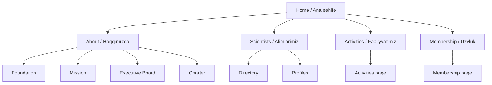

# DAAB / WAAS — Navigation and information architecture strategy

This document proposes a strategy to improve content organization, information architecture (IA), and navigation for the DAAB / WAAS bilingual website. It is based on the current site structure (`az/`, `en/`), pages defined in `i18n/routes.json`, labels in `i18n/ui.json`, and the existing navigation scripts (`js/daab-nav.js`, `js/daab-shell.js`).

**Document version:** 1.0  
**Date:** May 2026  
**Status:** Implemented (May 2026) — see `i18n/nav.json`, `js/daab-primary-nav.js`, `css/daab-nav-mega.css`

---

## 1. Executive summary

The site today exposes **eight to nine peer-level navigation links** plus one dropdown (Scientists). Related “about” and governance pages compete for attention at the same level as Activities and Membership. The recommended approach is to **group related pages under 5–6 top-level items**, use a **mega-menu for About** and a **simple dropdown for Scientists**, add **breadcrumbs and section navigation**, and keep **parallel AZ/EN structure** driven from centralized configuration.

**Target top-level menu (5 items):**

| # | Azerbaijani | English |
|---|-------------|---------|
| 1 | Ana səhifə | Home |
| 2 | Haqqımızda | About |
| 3 | Alimlərimiz | Scientists |
| 4 | Fəaliyyətimiz | Activities |
| 5 | Üzvlük | Membership |

---

## 2. Current state (diagnosis)

### 2.1 Existing pages (`i18n/routes.json`)

| Page ID | AZ path | EN path | Current nav |
|---------|---------|---------|-------------|
| `home` | `az/index.html` | `en/index.html` | Top-level |
| `foundation` | `az/foundation.html` | `en/foundation.html` | Top-level |
| `mission` | `az/mission.html` | `en/mission.html` | Top-level |
| `activities` | `az/activities.html` | `en/activities.html` | Top-level |
| `scientists-list` | `az/scientists/list.html` | `en/scientists/list.html` | Scientists dropdown |
| `scientists-profiles` | `az/scientists/profiles.html` | `en/scientists/profiles.html` | Scientists dropdown |
| `executive-board` | `az/executive-board.html` | `en/executive-board.html` | Top-level |
| `charter` | `az/charter.html` | `en/charter.html` | Top-level |
| `membership` | `az/membership.html` | `en/membership.html` | Top-level |

### 2.2 Strengths to preserve

- Bilingual paths (`/az/`, `/en/`) with `routes.json` and `ui.json`
- Language switcher (AZ / EN) in the header
- Skip-to-content link
- Active page highlighting (`aria-current`, `has-active-child` on dropdowns)
- Scientists dropdown pattern (already in `daab-nav.js`)
- Homepage card grid for discovery
- Hero CTAs (e.g. meet scientists, join)

### 2.3 Issues to address

| Issue | Impact |
|--------|--------|
| 8–9 peer-level nav links | High cognitive load on desktop and mobile |
| “About” split across four top-level items | Users unsure where governance vs. story lives |
| Two scientist views as separate nav destinations | Feels like two sites unless framed as one directory |
| Membership and Charter at top level | Compete with story and activity pages |
| No breadcrumbs | Weak orientation on deeper pages |
| Emoji in every nav label | Unusual for peer institutional sites; can hurt scanability |
| Nav duplicated in each HTML file | Hard to maintain; risk of AZ/EN drift |

---

## 3. Recommended hierarchical structure

### 3.1 Sitemap

```text
Ana səhifə / Home
│
├── Haqqımızda / About
│   ├── Birliyin təsisi / Foundation
│   ├── Missiya, vizyon və dəyərlər / Mission, vision & values
│   ├── İdarə heyəti / Executive board
│   └── Nizamnamə / Charter
│
├── Alimlərimiz / Scientists
│   ├── Alimlər kataloqu (siyahı) / Directory (list view)
│   └── Alim profilləri / Profiles (card view)
│
├── Fəaliyyətimiz / Activities
│
└── Üzvlük / Membership
```

### 3.2 Visual overview



---

## 4. Top-level vs submenu — explicit mapping

### 4.1 Top-level menu items

| Item | Page / hub | Rationale |
|------|------------|-----------|
| **Ana səhifə / Home** | `home` | Entry, search, highlights |
| **Haqqımızda / About** | Group (no single page required initially) | Identity, history, governance |
| **Alimlərimiz / Scientists** | Group; default → list | Core community asset |
| **Fəaliyyətimiz / Activities** | `activities` | Visible proof of work |
| **Üzvlük / Membership** | `membership` | Primary conversion path |

**Optional sixth item:** Əlaqə / Contact — only when a dedicated contact page exists (contact is currently footer-only).

### 4.2 Submenu under Haqqımızda / About

| Page ID | AZ label | EN label | Notes |
|---------|----------|----------|--------|
| `foundation` | Birliyin təsisi | Foundation | Historical narrative; why the union exists |
| `mission` | Missiya, vizyon və dəyərlər | Mission, vision & values | Strategic identity |
| `executive-board` | İdarə heyəti | Executive board | Leadership and structure |
| `charter` | Nizamnamə | Charter | Legal/governance; cross-link from Membership |

**Suggested default landing for About:** Mission (or a future `/about/` hub page).

### 4.3 Submenu under Alimlərimiz / Scientists

| Page ID | AZ label | EN label | Notes |
|---------|----------|----------|--------|
| `scientists-list` | Kataloq (siyahı) | Directory | Default entry when clicking parent |
| `scientists-profiles` | Profillər | Profiles | Secondary view; consider in-page list ↔ profile toggle |

### 4.4 Not in primary nav (utilities & footer)

- Language switcher (AZ / EN) — header utility, not a content section
- Site search — utility (extend beyond homepage when ready)
- Footer — full sitemap, contact, leadership, legal links

### 4.5 Quick decision table

| Page | Top-level? | Submenu under |
|------|------------|---------------|
| Home | Yes | — |
| Foundation | No | About |
| Mission | No | About |
| Executive board | No | About |
| Charter | No | About |
| Scientists list | No | Scientists (default) |
| Scientists profiles | No | Scientists |
| Activities | Yes | — |
| Membership | Yes | — |

---

## 5. Menu patterns: dropdown vs mega-menu

### 5.1 Standard dropdown — Scientists

Use when:

- There are **2–4** short links
- Labels fit on one line

**Scientists group:** keep a simple dropdown (or in-page view toggle with one nav entry).

Mobile: nested accordion or indented list under “Alimlərimiz”; auto-expand when a child page is active (supported today via `has-active-child`).

### 5.2 Mega-menu — About

Use when:

- There are **four or more** related pages
- One-line **descriptions** help scanning (common on university and association sites)

**Example mega-menu panel (AZ):**

| Link | Short description |
|------|-------------------|
| Birliyin təsisi | Şuşa xətti, İstanbul təsis görüşü və yaradılma tarixi |
| Missiyamız | Missiya, vizyon və akademik dəyərlər |
| İdarə heyəti | Sədr, üzvlər və struktur |
| Nizamnamə | Hüquqi əsas və idarəetmə qaydaları |

Avoid more than **two** dropdown/mega-menu parents at the top level (About + Scientists is sufficient).

### 5.3 Professional presentation

- Prefer **text-first** nav labels; use emojis only on homepage cards or optional mega-menu icons
- Optional **persistent “Üzvlük / Membership” CTA button** in the header in addition to the nav link

---

## 6. Multilingual navigation

### 6.1 Principles

1. **Parallel IA** — same groups, same order in AZ and EN; only labels and paths under `/az/` vs `/en/` differ.
2. **Centralized nav data** — extend `i18n/routes.json` or add `i18n/nav.json` with `group`, `parent`, `order`, `showInPrimaryNav`, `shortDescription` (mega-menu).
3. **Language switcher** — keep AZ/EN in header; switching lands on the **equivalent page** (page `id` in `routes.json`).
4. **Branding** — AZ user-facing: DAAB; EN user-facing: WAAS (consistent with EN rebrand); do not mix in the same label.
5. **SEO** — add `hreflang` and `<link rel="alternate">` per page (complements UI switcher).
6. **Incomplete EN** — stub pages can show “translation in progress” without changing IA shape.
7. **URLs** — keep stable slugs (`mission.html`, etc.) unless a redirect plan is committed; no translated slug paths required for v1.

### 6.2 Suggested `routes.json` extensions (illustrative)

```json
{
  "id": "mission",
  "navId": "mission",
  "navGroup": "about",
  "navParent": "about",
  "order": 2,
  "showInPrimaryNav": true,
  "shortDescription": {
    "az": "Missiya, vizyon və akademik dəyərlər",
    "en": "Mission, vision and academic values"
  }
}
```

---

## 7. Desktop and mobile navigation behavior

### 7.1 Desktop (≥1180px — aligns with current `daab-mobile.css` breakpoint)

| Element | Behavior |
|---------|----------|
| **About** | Hover opens mega-menu; keyboard: Enter/Space on toggle, arrow keys inside panel |
| **Scientists** | Simple dropdown; parent highlights when child is active |
| **Header** | Sticky; optional shrink on scroll |
| **CTA** | Optional primary “Üzvlük / Membership” button |

### 7.2 Mobile (≤1180px)

| Element | Behavior |
|---------|----------|
| **Drawer** | Hamburger opens full menu (`primaryNavMenu`) |
| **About** | Accordion with four child links; auto-expand if active |
| **Scientists** | Accordion or indented sub-links |
| **Priority order** | Home, Activities, Membership near top for thumb reach |
| **Close** | Close drawer on link click; Escape closes menu and dropdowns |
| **Touch** | Tap to open dropdowns (`needsTapDropdown()` in `daab-nav.js`) — no hover-only |

### 7.3 Accessibility requirements

- `aria-expanded`, `aria-haspopup` on toggles
- `role="menu"` / `menuitem` on dropdown panels
- Visible focus indicators on all interactive nav elements
- All grouped links remain available in the **mobile DOM** (not removed for clutter)
- Footer sitemap duplicates the full tree
- Keep skip link: “Məzmuna keç / Skip to content”

---

## 8. Breadcrumbs and wayfinding

### 8.1 Breadcrumbs

Show on **all pages except home**:

```text
Ana səhifə › Haqqımızda › Nizamnamə
Home › About › Charter
```

Rules:

- First segment links to home
- Middle segments link to parent section (About hub or default child)
- Last segment is plain text (current page)
- Mobile: truncate middle if needed (`Haqqımızda › … › Nizamnamə`)

Generate from `routes.json` `navParent` / `navGroup` metadata and labels in `ui.json`.

### 8.2 Section navigation (“In this section”)

On long **About** pages (Foundation, Charter), add a sidebar or horizontal sub-nav linking sibling pages:

- Foundation · Mission · Executive board · Charter

### 8.3 Page titles

Pattern: `{Page title} | DAAB` (AZ) and `{Page title} | WAAS` (EN).

---

## 9. Reducing clutter while preserving accessibility

| Technique | Reduces clutter | Preserves access |
|-----------|-----------------|------------------|
| Group four pages under About | −3 top-level links | All links in mobile accordion + footer |
| Footer sitemap | Shorter header | Full tree always reachable |
| Homepage cards | Nav stays short | Cards remain full visual sitemap |
| Remove nav emojis | Cleaner professional tone | Text labels unchanged |
| Scientists: one nav item + on-page view toggle | Optional −1 submenu link | Both URLs remain bookmarkable |
| Global search | Faster jump to content | Complements nav |
| `aria-current` on child + parent highlight | — | Already partially implemented |

**Do not** hide links only on hover without keyboard access.

---

## 10. User journeys (personas)

| Persona | Goal | Ideal path |
|---------|------|------------|
| New visitor | Understand credibility | Home → About (Mission) → Activities |
| Prospective member | Rules and how to join | Home → Membership → Charter (in context) |
| Researcher / partner | Find an expert | Home → Scientists (Directory) → profile |
| Media / institution | Evidence of activity | Activities → Executive board |
| Diaspora scientist | See peers | Scientists profiles ↔ list |
| English speaker | Same flows in EN | Language gateway → EN mirror paths |

**Homepage role:** emotional entry and **card grid as visual sitemap**; primary nav is the **compressed** executive summary.

**Membership:** repeat CTA in hero, nav (and optional header button), footer, and contextual links from About mega-menu.

---

## 11. Institutional and academic website best practices

1. **Audience-first labels** — “Haqqımızda” over internal jargon; “Fəaliyyətimiz” if content is events and cooperation, not only news.
2. **Governance grouped, not hidden** — Charter and Executive board under About signals transparency without dominating the bar.
3. **Activities prominent** — proof of international scientific and civic work.
4. **Directory as first-class** — the scientist network is the organization’s core asset.
5. **Trust stack** — on About landing or mega-menu: mission summary, leadership, link to charter.
6. **AZ/EN parity** — same IA; translate labels and body, not structure.
7. **Legal documents** — offer PDF download on Charter page and footer, not as a separate top-level item.

---

## 12. Modern UI/UX patterns (fit for DAAB / WAAS)

| Pattern | Fit | Recommendation |
|---------|-----|----------------|
| Mega-menu (About) | High | Short descriptions; optional small image |
| Simple dropdown (Scientists) | High | Two views or single entry + tabs |
| Sticky header | Medium | Keep nav visible on long Activities page |
| Primary CTA (“Üzvlük”) | High | Common on association sites |
| Global search | High | Extend `daab-search.js` beyond home |
| In-page section nav | High | Activities timeline, long Foundation |
| About hub landing page | Medium | Optional future `az/about.html` |
| Hamburger-only on desktop | Low | Room for 5 top-level items |
| Flag-only language control | Low | Text AZ/EN is clearer (current approach) |

---

## 13. Relationship to homepage content

The homepage **intro card grid** should continue to surface all major sections (Mission, Activities, Foundation, Scientists, Board, Charter, Membership). After IA restructuring:

- **Nav** = short, task-oriented (5 items + 2 groups)
- **Cards** = complete discovery layer for first-time visitors
- **Hero buttons** = two main actions (meet scientists, join)

No requirement to remove cards when nav is grouped.

---

## 14. Implementation roadmap

### Phase 1 — Data and labels (low risk)

- Extend `i18n/routes.json` with `navGroup`, `navParent`, `order`, descriptions
- Add grouped labels to `i18n/ui.json` (`nav.about`, child labels)
- Document IA in this file (done)

### Phase 2 — Single source of truth for nav

- Generate or inject nav HTML from JSON in `js/daab-shell.js`
- Remove duplicated nav markup from each HTML file (or generate via `helpers/_build_bilingual_tree.py`)
- Update AZ and EN pages together

### Phase 3 — UI components

- About mega-menu markup and CSS
- Breadcrumb component + styles
- “In this section” sidebar on About children

### Phase 4 — Scientists and polish

- Prominent list ↔ profiles toggle on scientist pages
- Default “Alimlərimiz” click → directory (list)
- Nav emoji cleanup; site-wide search
- Optional About hub page

---

## 15. Files and code touchpoints

| Area | Path |
|------|------|
| Route registry | `i18n/routes.json` |
| UI strings | `i18n/ui.json` |
| Nav behavior | `js/daab-nav.js` |
| Shell / injection | `js/daab-shell.js` |
| Mobile layout | `css/daab-mobile.css` |
| Build / publish | `helpers/_build_bilingual_tree.py`, `helpers/_publish_en_pages.py` |
| AZ pages | `az/**/*.html` |
| EN pages | `en/**/*.html` |

---

## 16. Success criteria

- Primary nav has **no more than 6** top-level items (including Home)
- Every current page remains reachable within **two clicks** from home (nav or cards)
- AZ and EN nav structures are **identical**
- Mobile menu exposes **all** links without horizontal scroll
- Active section visible (parent + child + breadcrumbs)
- Reduced maintenance: one nav definition updates all pages

---

## 17. Revision history

| Version | Date | Notes |
|---------|------|--------|
| 1.0 | May 2026 | Initial strategy document |

---

*For bilingual site setup and publishing, see also `DAAB-Bilingual-Website-Strategy.md` and `HOW-TO-USE-THE-BILINGUAL-SITE.md` in this folder.*
